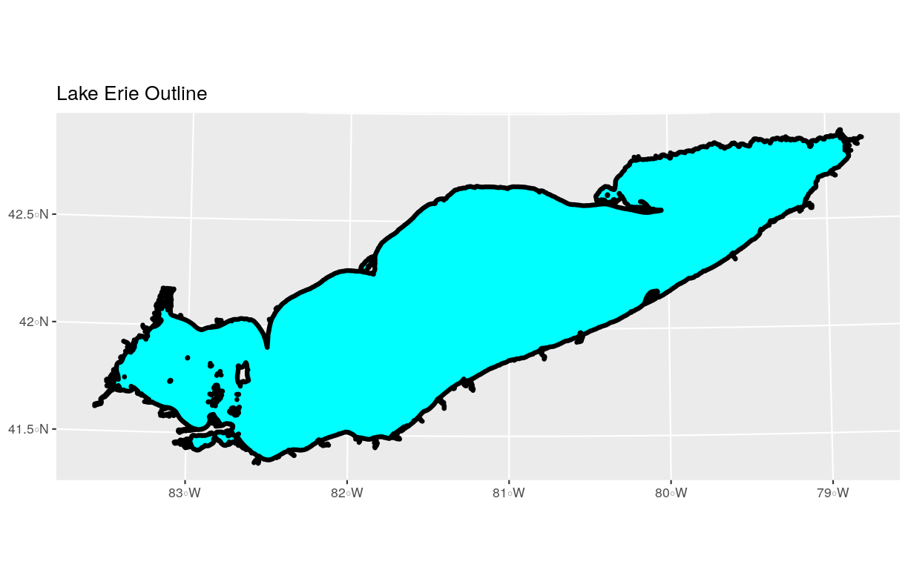

---
# Please do not edit this file directly; it is auto generated.
# Instead, please edit 01-vector-open-shapefile-in-r.md in _episodes_rmd/
title: "Open and Plot Shapefiles in R"
teaching: 20
exercises: 10
questions:
- "How can I distinguish between and visualize point, line and polygon vector data?"
objectives:
- "Know the difference between point, line, and polygon vector elements."
- "Load point, line, and polygon shapefiles into R."
- "Access the attributes of a spatial object in R."
keypoints:
- "Shapefile metadata include geometry type, CRS, and extent."
- "Load spatial objects into R with the `st_read()` function."
- "Spatial objects can be plotted directly with `ggplot` using the `geom_sf()` function. No need to convert to a dataframe."
source: Rmd
---

~~~
## Error in .local(.Object, ...) :
~~~
{: .output}

~~~
## Error in .rasterObjectFromFile(x, band = band, objecttype = "RasterLayer", : Cannot create a RasterLayer object from this file. (file does not exist)
~~~
{: .error}

> ## Things You’ll Need To Complete This Episode
> See the [lesson homepage]({{ site.baseurl }}) for detailed information about the software,
> data, and other prerequisites you will need to work through the examples in this episode.
{: .prereq}

In this episode, we will introduce the fundamental principles, packages and
metadata attributes that are needed to work with vector data in R. We will open
and plot point, line and polygon vector data stored in shapefile format in R.
In later episodes, we will learn how to work with raster and vector data
together and combine them into a single plot.

## Import Shapefiles

We will use the `sf` package to work with vector data in R. Notice that the
`rgdal` package automatically loads when `sf` is loaded. We will also use the
`raster` package, which we will work with in more detail in later episodes, so we can explore raster and vector spatial metadata using similar commands. Make sure you have the `sf` library loaded. 

~~~
library(sf)
~~~
{: .language-r}

The shapefiles that we will import are:

* A polygon shapefile representing the outline of Lake Erie
* A line shapefile representing bathymetry contours

The first shapefile that we will open contains the outline of Lake Erie. To
import shapefiles we use the `sf` function `st_read()`. `st_read()` requires
the file path to the shapefile.

Let's import our outline:

~~~
erie_outline <- st_read(
  "data/erie_outline.shp")
~~~
{: .language-r}

~~~
Reading layer `erie_outline' from data source `/home/jose/Documents/Science/Workshops/2020-02_glatos/glatos-spatial_workshop_materials/_episodes_rmd/data/erie_outline.shp' using driver `ESRI Shapefile'
Simple feature collection with 1 feature and 7 fields
geometry type:  POLYGON
dimension:      XY
bbox:           xmin: 285728.3 ymin: 4580281 xmax: 682178.4 ymax: 4752964
epsg (SRID):    NA
proj4string:    +proj=utm +zone=17 +ellps=GRS80 +units=m +no_defs
~~~
{: .output}

## Shapefile Metadata & Attributes

When we import the `Lake_Erie_Shoreline` shapefile layer into R (as our
`erie_outline` object), the `st_read()` function automatically stores
information about the data. We are particularly interested in the geospatial
metadata, describing the format, CRS, extent, and other components of
the vector data, and the attributes which describe properties associated
with each individual vector object.

> ## Data Tip
> The [Explore and Plot by Shapefile Attributes]({{site.baseurl}}/02-vector-shapefile-attributes-in-r/)
> episode provides more information on both metadata and attributes
> and using attributes to subset and plot data.
{: .callout}

## Spatial Metadata
Key metadata for all shapefiles include:

1. **Object Type:** the class of the imported object.
2. **Coordinate Reference System (CRS):** the projection of the data.
3. **Extent:** the spatial extent (i.e. geographic area that the shapefile covers) of
the shapefile. Note that the spatial extent for a shapefile represents the combined
extent for all spatial objects in the shapefile.

We can view shapefile metadata using the `st_geometry_type()`, `st_crs()` and 
`st_bbox()` functions. First, let's view the geometry type for our outline 
shapefile: 

~~~
st_geometry_type(erie_outline)
~~~
{: .language-r}

~~~
[1] POLYGON
18 Levels: GEOMETRY POINT LINESTRING POLYGON MULTIPOINT ... TRIANGLE
~~~
{: .output}

Our `erie_outline` is a polygon object. The 18 levels shown below
our output list the possible categories of the geometry type. 
Now let's check what CRS this file data is in:

~~~
st_crs(erie_outline)
~~~
{: .language-r}

~~~
Coordinate Reference System:
  No EPSG code
  proj4string: "+proj=utm +zone=17 +ellps=GRS80 +units=m +no_defs"
~~~
{: .output}

Our data in the CRS **UTM zone 17N**. The CRS is critical to 
interpreting the object's extent values as it specifies units. To find
the extent of our outline, we can use the `st_bbox()` function: 

~~~
st_bbox(erie_outline)
~~~
{: .language-r}

~~~
     xmin      ymin      xmax      ymax 
 285728.3 4580281.1  682178.4 4752964.4 
~~~
{: .output}

The spatial extent of a shapefile or R spatial object represents the geographic "edge" or location that is the furthest north, south east and west. Thus is represents the overall geographic coverage of the spatial object. 

Image Source: National Ecological Observatory Network (NEON).

Lastly, we can view all of the metadata and attributes for this shapefile object
by printing it to the screen:

~~~
erie_outline
~~~
{: .language-r}

~~~
Simple feature collection with 1 feature and 7 fields
geometry type:  POLYGON
dimension:      XY
bbox:           xmin: 285728.3 ymin: 4580281 xmax: 682178.4 ymax: 4752964
epsg (SRID):    NA
proj4string:    +proj=utm +zone=17 +ellps=GRS80 +units=m +no_defs
  OBJECTID PERIMETER LAKE_NAME ID ReferenceC  ShapeSTAre ShapeSTLen
1        1   2445211 Lake Erie  1   60402132 25830205908    2445211
                        geometry
1 POLYGON ((643010.3 4749291,...
~~~
{: .output}

## Spatial Data Attributes
Now we will explore how to use spatial data attributes stored in our data to 
plot different features.

## Plot a Shapefile

Let's visualize the data in our `sf` object using the `ggplot` package. Unlike 
with raster data, we do not need to convert vector data to a dataframe before 
plotting with `ggplot`. 

We're going to customize our boundary plot by setting the size, color, and fill 
for our plot. When plotting `sf` objects with `ggplot2`, you do not need to use 
the `coord_sf()` coordinate system.

~~~
library(ggplot2)

ggplot() + 
  geom_sf(data = erie_outline, size = 1.5, color = "black", fill = "cyan1") + 
  ggtitle("Lake Erie Outline") + 
  coord_sf()
~~~
{: .language-r}

> ## Challenge: Import Line and Point Shapefiles
> 
> Using the steps above, import the erie_contours layer into
> R. Call the object `erie_contours`.
> 
> Answer the following questions:
> 
> 1. What type of R spatial object is created when you import the layer?
> 
> 2. What is the CRS and extent of the object?
> 
> 3. Does the file contain points, lines, or polygons?
> 
> 4. How many spatial objects are in the file?
> 
> > ## Answers
> > 
> > First we import the data: 
> > 
> > ~~~
> > erie_contours <- st_read("data/erie_contours.shp")
> > ~~~
> > {: .language-r}
> > 
> > 
> > 
> > ~~~
> > Reading layer `erie_contours' from data source `/home/jose/Documents/Science/Workshops/2020-02_glatos/glatos-spatial_workshop_materials/_episodes_rmd/data/erie_contours.shp' using driver `ESRI Shapefile'
> > Simple feature collection with 8764 features and 3 fields
> > geometry type:  LINESTRING
> > dimension:      XY
> > bbox:           xmin: -83.57167 ymin: 41.36359 xmax: -78.7695 ymax: 42.9103
> > epsg (SRID):    4326
> > proj4string:    +proj=longlat +datum=WGS84 +no_defs
> > ~~~
> > {: .output}
> > 
> > Then we check its class: 
> > 
> > ~~~
> > class(erie_contours)
> > ~~~
> > {: .language-r}
> > 
> > 
> > 
> > ~~~
> > [1] "sf"         "data.frame"
> > ~~~
> > {: .output}
> > We also check the CRS and extent of the object: 
> > 
> > ~~~
> > st_crs(erie_contours)
> > ~~~
> > {: .language-r}
> > 
> > 
> > 
> > ~~~
> > Coordinate Reference System:
> >   EPSG: 4326 
> >   proj4string: "+proj=longlat +datum=WGS84 +no_defs"
> > ~~~
> > {: .output}
> > 
> > 
> > 
> > ~~~
> > st_bbox(erie_contours)
> > ~~~
> > {: .language-r}
> > 
> > 
> > 
> > ~~~
> >      xmin      ymin      xmax      ymax 
> > -83.57167  41.36359 -78.76950  42.91030 
> > ~~~
> > {: .output}
> > To see the number of objects in the file, we can look at the output from when we read these objects into R. 
> > `erie_contours` contains 8764 features (all lines). 
> {: .solution}
{: .challenge}


