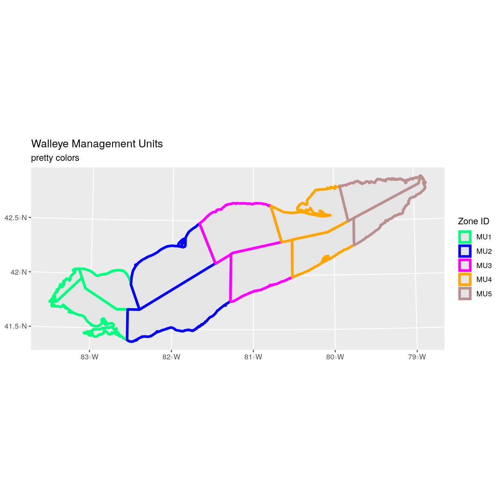

---
# Please do not edit this file directly; it is auto generated.
# Instead, please edit 02-vector-shapefile-attributes-in-r.md in _episodes_rmd/
title: "Explore and Plot by Shapefile Attributes"
teaching: 40
exercises: 20
questions:
- "How can I compute on the attributes of a spatial object?"
objectives:
- "Query attributes of a spatial object."
- "Subset spatial objects using specific attribute values."
- "Plot a shapefile, colored by unique attribute values."
keypoints:
- "Spatial objects in `sf` are similar to standard data frames and can be manipulated using the same functions."
- "Almost any feature of a plot can be customized using the various functions and options in the `ggplot2` package."
source: Rmd
---

> ## Things You’ll Need To Complete This Episode
> See the [lesson homepage]({{ site.baseurl }}) for detailed information about the software,
> data, and other prerequisites you will need to work through the examples in this episode.
{: .prereq}

This episode continues our discussion of shapefile attributes and 
covers how to work with shapefile attributes in R. It covers how
to identify and query shapefile attributes, as well as how to subset shapefiles 
by specific attribute values. Finally, we will learn how to plot a shapefile 
according to a set of attribute values.

## Load the Data
We will continue using the `sf`, `raster` and `ggplot2` packages in this episode. Make sure that you have these packages loaded. We will
continue to work with the three shapefiles that we loaded in the
[Open and Plot Shapefiles in R]({{site.baseurl}}/01-vector-open-shapefile-in-r/) episode.

## Query Shapefile Metadata

As we discussed in the
[Open and Plot Shapefiles in R]({{site.baseurl}}/01-vector-open-shapefile-in-r/) episode,
we can view metadata associated with an R object using:

* `st_geometry_type()` - The type of vector data stored in the object.
* `nrow()` - The number of features in the object
* `st_bbox()` - The spatial extent (geographic area covered by) 
of the object.
* `st_crs()` - The CRS (spatial projection) of the data.

We started to explore our `erie_outline` object in the previous episode. Here, we will look at a more complex object representing Lake Erie management zones.

~~~
erie_zones <- st_read(
  "data/Lake_Erie_Walleye_Management_Units/Lake_Erie_Walleye_Management_Units_utm.shp")
~~~
{: .language-r}

~~~
Reading layer `Lake_Erie_Walleye_Management_Units_utm' from data source `/home/jose/Documents/Science/Workshops/2020-02_glatos/glatos-spatial_workshop_materials/_episodes_rmd/data/Lake_Erie_Walleye_Management_Units/Lake_Erie_Walleye_Management_Units_utm.shp' using driver `ESRI Shapefile'
Simple feature collection with 11 features and 8 fields
geometry type:  POLYGON
dimension:      XY
bbox:           xmin: 292076.1 ymin: 4582052 xmax: 675959 ymax: 4751574
epsg (SRID):    NA
proj4string:    +proj=utm +zone=17 +ellps=GRS80 +units=m +no_defs
~~~
{: .output}

To see a summary of all of the metadata associated with our `erie_zones` object, we can view the object with `View(erie_zones)` or print a summary of the object itself to the console.

~~~
erie_zones
~~~
{: .language-r}

~~~
Simple feature collection with 11 features and 8 fields
geometry type:  POLYGON
dimension:      XY
bbox:           xmin: 292076.1 ymin: 4582052 xmax: 675959 ymax: 4751574
epsg (SRID):    NA
proj4string:    +proj=utm +zone=17 +ellps=GRS80 +units=m +no_defs
First 10 features:
   OBJECTID  NAME     SQ_KM  HECTARES      ACRES MGMTUNIT Shape_Leng Shape_Area
1         1 Mich.  323.4672  32346.73   79928.76      MU1   1.996955 0.03514546
2         2  OE-5 1764.0675 176406.75  435901.07      MU5   2.665866 0.19481404
3         3  OE-1 1565.6603 156566.03  386874.66      MU1   1.931562 0.16991382
4         4   O-1 1975.1655 197516.55  488063.40      MU1   4.927572 0.21340517
5         5  OE-2 3556.8141 355681.41  878888.76      MU2   3.153808 0.38810201
6         6   O-2 4532.7467 453274.67 1120041.71      MU2   3.820894 0.48906958
7         7  OE-3 3383.3656 338336.56  836029.63      MU3   2.594871 0.37061446
8         8   O-3 2740.7223 274072.23  677232.49      MU3   2.490809 0.29805226
9         9  OE-4 2507.6910 250769.10  619650.44      MU4   3.720807 0.27520295
10       10 Penn. 1969.0486 196904.86  486551.90      MU4   2.717525 0.21485187
                         geometry
1  POLYGON ((324940.2 4647311,...
2  POLYGON ((670839.7 4751554,...
3  POLYGON ((322074.6 4656546,...
4  POLYGON ((295773.4 4622956,...
5  POLYGON ((374929.3 4640631,...
6  POLYGON ((371024 4584031, 3...
7  POLYGON ((445085.4 4702716,...
8  POLYGON ((476645.9 4623456,...
9  POLYGON ((587978.5 4741264,...
10 POLYGON ((539843.7 4647691,...
~~~
{: .output}

We can use the `ncol` function to count the number of attributes associated with a spatial object too. Note that the geometry is just another column and counts towards the total.

~~~
ncol(erie_zones)
~~~
{: .language-r}

~~~
[1] 9
~~~
{: .output}

We can view the individual name of each attribute using the
`names()` function in R:

~~~
names(erie_zones)
~~~
{: .language-r}

~~~
[1] "OBJECTID"   "NAME"       "SQ_KM"      "HECTARES"   "ACRES"     
[6] "MGMTUNIT"   "Shape_Leng" "Shape_Area" "geometry"  
~~~
{: .output}

We could also view just the first 6 rows
of attribute values using the `head()` function to get a preview of the data:

~~~
head(erie_zones)
~~~
{: .language-r}

~~~
Simple feature collection with 6 features and 8 fields
geometry type:  POLYGON
dimension:      XY
bbox:           xmin: 292076.1 ymin: 4582052 xmax: 670839.7 ymax: 4751574
epsg (SRID):    NA
proj4string:    +proj=utm +zone=17 +ellps=GRS80 +units=m +no_defs
  OBJECTID  NAME     SQ_KM  HECTARES      ACRES MGMTUNIT Shape_Leng Shape_Area
1        1 Mich.  323.4672  32346.73   79928.76      MU1   1.996955 0.03514546
2        2  OE-5 1764.0675 176406.75  435901.07      MU5   2.665866 0.19481404
3        3  OE-1 1565.6603 156566.03  386874.66      MU1   1.931562 0.16991382
4        4   O-1 1975.1655 197516.55  488063.40      MU1   4.927572 0.21340517
5        5  OE-2 3556.8141 355681.41  878888.76      MU2   3.153808 0.38810201
6        6   O-2 4532.7467 453274.67 1120041.71      MU2   3.820894 0.48906958
                        geometry
1 POLYGON ((324940.2 4647311,...
2 POLYGON ((670839.7 4751554,...
3 POLYGON ((322074.6 4656546,...
4 POLYGON ((295773.4 4622956,...
5 POLYGON ((374929.3 4640631,...
6 POLYGON ((371024 4584031, 3...
~~~
{: .output}

> ## Challenge: Attributes for Different Spatial Classes
>
> Explore the attributes associated with the `erie_zones` spatial object.
>
> 1. How many attributes does it have?
> 2. Which of the following is NOT an attribute of the `erie_outline` data object?
>
>     A) NAME      B) MGMTUNIT     C) MGMTZONE
>
> > ## Answers
> > 1) To find the number of attributes, we use the `ncol()` function: 
> > 
> > 
> > ~~~
> > ncol(erie_zones)
> > ~~~
> > {: .language-r}
> > 
> > 
> > 
> > ~~~
> > [1] 9
> > ~~~
> > {: .output}
> > 2) To see a list of all of the attributes, we can use the
> > `names()` function: 
> > 
> > ~~~
> > names(erie_zones)
> > ~~~
> > {: .language-r}
> > 
> > 
> > 
> > ~~~
> > [1] "OBJECTID"   "NAME"       "SQ_KM"      "HECTARES"   "ACRES"     
> > [6] "MGMTUNIT"   "Shape_Leng" "Shape_Area" "geometry"  
> > ~~~
> > {: .output}
> > "MGMTZONE" is not an attribute of this object. 
> {: .solution}
{: .challenge}

## Explore Values within One Attribute
We can explore individual values stored within a particular attribute.
Comparing attributes to a spreadsheet or a data frame, this is similar
to exploring values in a column. For spatial objects, we can use the syntax: `objectName$attributeName`.

We can see the contents of the `MGMTUNIT` field of our vector object:

~~~
erie_zones$MGMTUNIT
~~~
{: .language-r}

~~~
 [1] MU1 MU5 MU1 MU1 MU2 MU2 MU3 MU3 MU4 MU4 MU5
Levels: MU1 MU2 MU3 MU4 MU5
~~~
{: .output}

To see only unique values within the `MGMTUNIT` field, we can use the
`levels()` function for extracting the possible values of a
categorical variable. The special term for categorical variables
within R is factor.

~~~
levels(erie_zones$MGMTUNIT)
~~~
{: .language-r}

~~~
[1] "MU1" "MU2" "MU3" "MU4" "MU5"
~~~
{: .output}

### Subset Shapefiles
We can use the `filter()` function from `dplyr` to select a subset of features
from a spatial object in R, just like with data frames.

For example, we might be interested only in features that are of `MGMTUNIT` "MU5". Once we subset out this data, we can use it as input to other code so  that code only operates on the MU5 management zones.

~~~
zone_5 <- erie_zones %>% 
  dplyr::filter(MGMTUNIT == "MU5")
nrow(zone_5)
~~~
{: .language-r}

~~~
[1] 2
~~~
{: .output}

Our subsetting operation reduces the `features` count to 2. This means
that only two feature polygons in our spatial object have the attribute
`MGMTUNIT == MU5`. We can plot only these polygons:

~~~
ggplot() + 
  geom_sf(data = zone_5) +
  ggtitle("Walleye Management Units", subtitle = "Zone 5") + 
  coord_sf()
~~~
{: .language-r}

There are two features in our subset. Why does the plot look like
there is only one feature? Let's adjust the colors used in our plot. If we have
2 features in our vector object, we can plot each using a unique color by
assigning a column name to the color aesthetic (`color =`). We use the syntax
`aes(color = )` to do this. We can also alter the default line thickness by
using the `size =` parameter, as the default value of 0.5 can be hard to see.
Note that size is placed outside of the `aes()` function, as we are not
connecting line thickness to a data variable.

~~~
ggplot() + 
  geom_sf(data = zone_5, aes(color = factor(OBJECTID)), size = 1.5) +
  labs(color = 'Polygon ID') +
  ggtitle("Walleye Management Units", subtitle = "Zone 5") + 
  coord_sf()
~~~
{: .language-r}

Now, we see that there are in fact two features in our plot!

> ## Challenge: Subset Spatial Objects Part 1
> 
> Subset out all `erie_zones` that have an area greater than 3000 square kilometers and plot it.
>
> > ## Answers
> > 
> > First we will filter our object by the SQ_KM attribute:
> > 
> > ~~~
> > erie_zones_big <- erie_zones %>% 
> >   dplyr::filter(SQ_KM > 3000)
> > ~~~
> > {: .language-r}
> > Let's check how many features there are in this subset: 
> > 
> > ~~~
> > nrow(erie_zones_big)
> > ~~~
> > {: .language-r}
> > 
> > 
> > 
> > ~~~
> > [1] 3
> > ~~~
> > {: .output}
> > Now let's plot that data: 
> > 
> > ~~~
> > ggplot() + 
> >   geom_sf(data = erie_zones_big, size = 1.5) +
> >   ggtitle("Big Management Zones") + 
> >   coord_sf()
> > ~~~
> > {: .language-r}
> > 
> > 
> {: .solution}
{: .challenge}

> ## Challenge: Subset Spatial Line Objects Part 2
>
> Subset out all `stone wall` features from the lines layer and plot it. For each plot, color each feature using a unique color.
>
> > ## Answer
> >
> > First we will save an object with only the stone wall lines
> > and check the number of features: 
> > 
> > ~~~
> > stoneWall_HARV <- erie_zones %>% 
> >   filter(MGMTUNIT == "stone wall")
> > nrow(stoneWall_HARV)
> > ~~~
> > {: .language-r}
> > 
> > 
> > 
> > ~~~
> > [1] 0
> > ~~~
> > {: .output}
> > Now we can plot the data: 
> > 
> > ~~~
> > ggplot() +
> >   geom_sf(data = stoneWall_HARV, aes(color = factor(OBJECTID)), size = 1.5) +
> >   labs(color = 'Wall ID') +
> >   ggtitle("NEON Harvard Forest Field Site", subtitle = "Stonewalls") + 
> >   coord_sf()
> > ~~~
> > {: .language-r}
> > 
> > 
> {: .solution}
{: .challenge}

## Customize Plots

In the examples above, `ggplot()` automatically selected colors for
each line based on a default color order. If we don't like those
default colors, we can create a vector of colors - one for each
feature. To create this vector we can use the following syntax:

`c("color_one", "color_two", "color_three")[object$factor]`

Note in the above example we have

1. a vector of colors - one for each factor value (unique attribute value)
2. the attribute itself (`[object$factor]`) of class factor.

First we will check how many unique levels our factor has:

~~~
levels(erie_zones$MGMTUNIT)
~~~
{: .language-r}

~~~
[1] "MU1" "MU2" "MU3" "MU4" "MU5"
~~~
{: .output}

Then we can create a pallet of four colors, one for each
feature in our vector object.

~~~
zone_colors <- c("blue", "green", "navy", "purple", "orange")
~~~
{: .language-r}

We can tell `ggplot` to use these colors when we plot the data.

~~~
ggplot() +
  geom_sf(data = erie_zones, aes(color = MGMTUNIT)) + 
  scale_color_manual(values = zone_colors) +
  labs(color = 'Unit ID') +
  ggtitle("Walleye Management Units", subtitle = "colored by zone") + 
  coord_sf()
~~~
{: .language-r}

### Adjust Line Width
We adjusted line width universally earlier. If we want a unique line width for each factor level or attribute category
in our spatial object, we can use the same syntax that we used for colors, above.

We already know that we have five different `MGMTUNIT` levels in the erie_zones object, so we will set five different line widths.

~~~
line_widths <- c(1, 2, 3, 4, 5)
~~~
{: .language-r}

We can use those line widths when we plot the data.

~~~
ggplot() +
  geom_sf(data = erie_zones, aes(color = MGMTUNIT, size = MGMTUNIT)) + 
  scale_color_manual(values = zone_colors) +
  labs(color = 'Unit ID') +
  scale_size_manual(values = line_widths) +
  ggtitle("Walleye Management Units", subtitle = "line width varies by zone") + 
  coord_sf()
~~~
{: .language-r}

> ## Challenge: Plot Line Width by Attribute
> 
> In the example above, we set the line widths to be 1, 2, 3, and 4.
> Because R orders factor levels alphabetically by default,
> this gave us a plot where zone 5 (the last factor level)
> was the thickest and zone 1 was the thinnest.
>
> Let's create another plot where we show the different line types
> with the following thicknesses:
>
> 1. zone 1 = 6
> 2. zone 2 = 1
> 3. zone 3 = 3
> 4. zone 4 = 2
> 5. zone 5 = 1
> 
> > ## Answers
> > 
> > First we need to look at the levels of our factor to see
> > what order the road types are in:
> >
> > 
> > ~~~
> > levels(erie_zones$MGMTUNIT)
> > ~~~
> > {: .language-r}
> > 
> > 
> > 
> > ~~~
> > [1] "MU1" "MU2" "MU3" "MU4" "MU5"
> > ~~~
> > {: .output}
> >
> > We then can create our `line_width` vector setting each of the
> > levels to the desired thickness.
> >
> > 
> > ~~~
> > line_width <- c(6, 1, 3, 2, 1)
> > ~~~
> > {: .language-r}
> >
> > Now we can create our plot.
> >
> > 
> > ~~~
> > ggplot() +
> >   geom_sf(data = erie_zones, aes(size = MGMTUNIT)) +
> >   scale_size_manual(values = line_width) +
> >   ggtitle("Walleye Management Units", subtitle = "line width varies by zone manually") +  
> >   coord_sf()
> > ~~~
> > {: .language-r}
> > 
> > 
> {: .solution}
{: .challenge}

### Add Plot Legend

We can add a legend to our plot too. When we add a legend, we use the following
elements to specify labels and colors:

* `bottomright`: We specify the location of our legend by using a default
keyword. We could also use `top`, `topright`, etc.
* `levels(objectName$attributeName)`: Label the legend elements using the
categories of levels in an attribute (e.g., levels(erie_zones$MGMTUNIT) means use
the levels boardwalk, footpath, etc).
* `fill =`: apply unique colors to the boxes in our legend. `palette()` is
the default set of colors that R applies to all plots.

Let's add a legend to our plot. We will use the `zone_colors` object
that we created above to color the legend. We can customize the
appearance of our legend by manually setting different parameters.

~~~
ggplot() + 
  geom_sf(data = erie_zones, aes(color = MGMTUNIT), size = 1.5) +
  scale_color_manual(values = zone_colors) +
  labs(color = 'Zone ID') + 
  ggtitle("Walleye Management Units", subtitle = "default legend") +  
  coord_sf()
~~~
{: .language-r}

We can change the appearance of our legend by manually setting different parameters.

* `legend.text`: change the font size
* `legend.box.background`: add an outline box

~~~
ggplot() + 
  geom_sf(data = erie_zones, aes(color = MGMTUNIT), size = 1.5) +
  scale_color_manual(values = zone_colors) + 
  labs(color = 'Zone ID') +
  theme(legend.text = element_text(size = 20), 
        legend.box.background = element_rect(size = 1)) + 
  ggtitle("Walleye Management Units", subtitle = "modified legend") +  
  coord_sf()
~~~
{: .language-r}

~~~
new_colors <- c("springgreen", "blue", "magenta", "orange", "rosybrown")

ggplot() + 
  geom_sf(data = erie_zones, aes(color = MGMTUNIT), size = 1.5) + 
  scale_color_manual(values = new_colors) +
  labs(color = 'Zone ID') +
  theme(legend.text = element_text(size = 20), 
        legend.box.background = element_rect(size = 1)) + 
  ggtitle("Walleye Management Units", subtitle = "pretty colors") +  
  coord_sf()
~~~
{: .language-r}

> ## Data Tip
> You can modify the default R color palette
> using the palette method. For example `palette(rainbow(6))` or
> `palette(terrain.colors(6))`. You can reset the palette colors using
> `palette("default")`!
{: .callout}

> ## Challenge: Plot Lines by Attribute
> 
> Create a plot that emphasizes only roads where bicycles and horses are allowed.
> To emphasize this, make the lines where bicycles are not allowed THINNER than
> the roads where bicycles are allowed.
> NOTE: this attribute information is located in the `erie_zones$BicyclesHo`
> attribute.
> 
> Be sure to add a title and legend to your map. You might consider a color
> palette that has all bike/horse-friendly roads displayed in a bright color. All
> other lines can be black.
> 
> > ## Answers
> >
> > First we need to make sure that the `BicyclesHo` attribute is a
> > factor and check how many levels it has.
> >
> > 
> > ~~~
> > class(erie_zones$BicyclesHo)
> > ~~~
> > {: .language-r}
> > 
> > 
> > 
> > ~~~
> > [1] "NULL"
> > ~~~
> > {: .output}
> > 
> > 
> > 
> > ~~~
> > levels(erie_zones$BicyclesHo)
> > ~~~
> > {: .language-r}
> > 
> > 
> > 
> > ~~~
> > NULL
> > ~~~
> > {: .output}
> >
> > Next, we will create a new object `lines_removeNA` that removes missing values.
> >
> > 
> > ~~~
> > lines_removeNA <- erie_zones[na.omit(erie_zones$BicyclesHo),]
> > ~~~
> > {: .language-r}
> >
> > In our plot, we will set colors so that only the allowed roads
> > are magenta, and we will set line width so that the first
> > factor level is thicker than the others.
> >
> > 
> > ~~~
> > ggplot() + 
> >   geom_sf(data = erie_zones) + 
> >   geom_sf(data = lines_removeNA, aes(color = BicyclesHo), size = 2) + 
> >   scale_color_manual(values = "magenta") +
> >   ggtitle("NEON Harvard Forest Field Site", subtitle = "Roads Where Bikes and Horses Are Allowed") + 
> >   coord_sf()
> > ~~~
> > {: .language-r}
> > 
> > 
> > 
> > ~~~
> > Error in FUN(X[[i]], ...): object 'BicyclesHo' not found
> > ~~~
> > {: .error}
> > 
> > 
> {: .solution}
{: .challenge}

> ## Challenge: Plot Polygon by Attribute
>
> 1. Create a map of the state boundaries in the United States using the data
> located in your downloaded data folder: `NEON-DS-Site-Layout-Files/US-Boundary-Layers\US-State-Boundaries-Census-2014`.
> Apply a fill color to each state using its `region` value. Add a legend.
>
> > ## Answers
> > First we read in the data and check how many levels there are
> > in the `region` column:
> > 
> > ~~~
> > state_boundary_US <- 
> > st_read("data/NEON-DS-Site-Layout-Files/US-Boundary-Layers/US-State-Boundaries-Census-2014.shp")
> > ~~~
> > {: .language-r}
> > 
> > 
> > 
> > ~~~
> > Error: Cannot open "data/NEON-DS-Site-Layout-Files/US-Boundary-Layers/US-State-Boundaries-Census-2014.shp"; The file doesn't seem to exist.
> > ~~~
> > {: .error}
> > 
> > 
> > 
> > ~~~
> > levels(state_boundary_US$region)
> > ~~~
> > {: .language-r}
> > 
> > 
> > 
> > ~~~
> > Error in levels(state_boundary_US$region): object 'state_boundary_US' not found
> > ~~~
> > {: .error}
> > Next we set a color vector with that many items: 
> > 
> > ~~~
> > colors <- c("purple", "springgreen", "yellow", "brown", "navy")
> > ~~~
> > {: .language-r}
> > Now we can create our plot: 
> > 
> > ~~~
> > ggplot() +
> >   geom_sf(data = state_boundary_US, aes(color = region), size = 1) +
> >   scale_color_manual(values = colors) +
> >   ggtitle("Contiguous U.S. State Boundaries") + 
> >   coord_sf()
> > ~~~
> > {: .language-r}
> > 
> > 
> > 
> > ~~~
> > Error in fortify(data): object 'state_boundary_US' not found
> > ~~~
> > {: .error}
> {: .solution}
{: .challenge}



