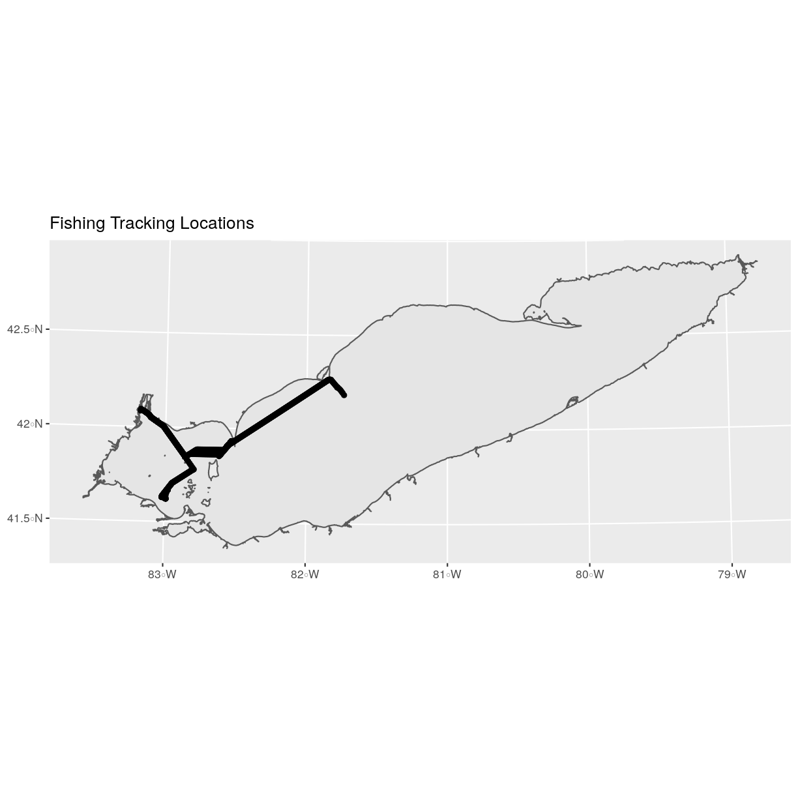

---
# Please do not edit this file directly; it is auto generated.
# Instead, please edit 03-vector-csv-to-shapefile-in-r.md in _episodes_rmd/
title: "Convert from .csv to a Shapefile in R"
teaching: 40
exercises: 20
questions:
- "How can I import CSV files as shapefiles in R?"
objectives:
- "Import .csv files containing x,y coordinate locations into R as a data frame."
- "Convert a data frame to a spatial object."
- "Export a spatial object to a text file."
keypoints:
- "Know the projection (if any) of your point data prior to converting to a spatial object."
- "Convert a data frame to an `sf` object using the `st_as_sf()` function."
- "Export an `sf` object as text using the `st_write()` function."
source: Rmd
---

> ## Things You’ll Need To Complete This Episode
> See the [lesson homepage]({{ site.baseurl }}) for detailed information about the software,
> data, and other prerequisites you will need to work through the examples in this episode.
{: .prereq}

This episode will review how to import spatial points stored in `.csv` (Comma Separated Value) format into R as an `sf` spatial object. We will also reproject data imported from a shapefile format, export this data as a shapefile, and plot raster and vector data as layers in the same plot.

## Spatial Data in Text Format

The `fish_tracks.csv` file contains `x, y` (point) locations from a fish tracking study in Lake Erie.

We would like to:

* Create a map of fish tracking locations.
* Export the data in a `shapefile` format to share with our colleagues. This
shapefile can be imported into any GIS software.
* Create a map showing fish management zones with tracking positions layered on top.

Spatial data are sometimes stored in a text file format (`.txt` or `.csv`). If
the text file has an associated `x` and `y` location column, then we can
convert it into an `sf` spatial object. The `sf` object allows us to store both the `x,y` values that represent the coordinate location
of each point and the associated attribute data - or columns describing each
feature in the spatial object.

We will continue using the `sf` package in this episode.

## Import .csv
To begin let's import a `.csv` file that contains fish tracking coordinate `x, y`
locations in Lake Erie (`fish_tracks.csv`) and look at the
structure of that new object:

~~~
fish_tracks <-
  read.csv("data/fish_tracks.csv")

str(fish_tracks)
~~~
{: .language-r}

~~~
'data.frame':	1366 obs. of  6 variables:
 $ animal_id    : int  16176001 16176001 16176001 16176001 16176001 16176001 16176001 16176001 16176001 16176001 ...
 $ bin_timestamp: Factor w/ 1226 levels "2014-05-06 04:59:17",..: 1 2 2 3 4 5 6 7 8 9 ...
 $ record_type  : Factor w/ 2 levels "detection","interpolated": 1 1 1 2 1 2 2 2 2 2 ...
 $ X            : num  335496 334227 335496 334107 335496 ...
 $ Y            : num  4614819 4609585 4614819 4611017 4614819 ...
 $ utmZone      : int  17 17 17 17 17 17 17 17 17 17 ...
~~~
{: .output}

We now have a data frame that contains 1366 location observations (rows) and 6 variables (attributes). Note that all of our character data was imported into R as factor (categorical) data. Next, let's explore the dataframe to determine whether it contains columns with coordinate values. If we are lucky, our `.csv` will contain columns labeled:

 * "X" and "Y" OR
 * Latitude and Longitude OR
 * easting and northing (UTM coordinates)

Let's check out the column names of our dataframe.

~~~
names(fish_tracks)
~~~
{: .language-r}

~~~
[1] "animal_id"     "bin_timestamp" "record_type"   "X"            
[5] "Y"             "utmZone"      
~~~
{: .output}

## Identify X,Y Location Columns

Our column names include several fields that might contain spatial information. The `fish_tracks$X`
and `fish_tracks$Y` columns contain coordinate values. We can confirm
this by looking at the first six rows of our data.

~~~
head(fish_tracks$X)
~~~
{: .language-r}

~~~
[1] 335496.0 334227.4 335496.0 334107.1 335496.0 335496.0
~~~
{: .output}

~~~
head(fish_tracks$Y)
~~~
{: .language-r}

~~~
[1] 4614819 4609585 4614819 4611017 4614819 4614819
~~~
{: .output}

We have coordinate values in our data frame. In order to convert our
data frame to an `sf` object, we also need to know the CRS
associated with those coordinate values.

There are several ways to figure out the CRS of spatial data in text format.

1. We can check the file metadata in hopes that the CRS was recorded in the
data.
2. We can explore the file itself to see if CRS information is embedded in the
file header or somewhere in the data columns.

It is not typical to store CRS information in a column. But this particular
file contains CRS information this way. The `utmZone` column
contain the information that helps us determine the CRS:

* `utmZone`: 17

In
[When Vector Data Don't Line Up - Handling Spatial Projection & CRS in R]({{site.baseurl}}/09-vector-when-data-dont-line-up-crs/)
we learned about the components of a `proj4` string. We have everything we need
to assign a CRS to our data frame.

To create the `proj4` associated with UTM Zone 17 WGS84 we can look up the
projection on the [Spatial Reference website](http://www.spatialreference.org/ref/epsg/wgs-84-utm-zone-17n/), which contains a list of CRS formats for each projection. From here, we can extract the [proj4 string for UTM Zone 17N WGS84](http://www.spatialreference.org/ref/epsg/wgs-84-utm-zone-17n/proj4/).

However, if we have other data in the UTM Zone 17N projection, it's much
easier to use the `st_crs()` function to extract the CRS in `proj4` format from
that object and assign it to our new spatial object. We've seen this CRS before
with our Lake Erie outline (`erie_outline`).

~~~
st_crs(erie_outline)
~~~
{: .language-r}

~~~
Coordinate Reference System:
  No EPSG code
  proj4string: "+proj=utm +zone=17 +ellps=GRS80 +units=m +no_defs"
~~~
{: .output}

The output above shows that the points shapefile is in
UTM zone 17N. We can thus use the CRS from that spatial object to convert our
non-spatial dataframe into an `sf` object.

Next, let's create a `crs` object that we can use to define the CRS of our
`sf` object when we create it.

~~~
utm17nCRS <- st_crs(erie_outline)
utm17nCRS
~~~
{: .language-r}

~~~
Coordinate Reference System:
  No EPSG code
  proj4string: "+proj=utm +zone=17 +ellps=GRS80 +units=m +no_defs"
~~~
{: .output}

~~~
class(utm17nCRS)
~~~
{: .language-r}

~~~
[1] "crs"
~~~
{: .output}

## .csv to sf object
Next, let's convert our dataframe into an `sf` object. To do
this, we need to specify:

1. The columns containing X (`easting`) and Y (`northing`) coordinate values
2. The CRS that the column coordinate represent (units are included in the CRS) - stored in our `utmCRS` object.

We will use the `st_as_sf()` function to perform the conversion.

~~~
fish_locations <- st_as_sf(fish_tracks, coords = c("X", "Y"), 
                                   crs = utm17nCRS)
~~~
{: .language-r}

We should double check the CRS to make sure it is correct.

~~~
st_crs(fish_locations)
~~~
{: .language-r}

~~~
Coordinate Reference System:
  No EPSG code
  proj4string: "+proj=utm +zone=17 +ellps=GRS80 +units=m +no_defs"
~~~
{: .output}

## Plot Spatial Object
We now have a spatial R object, we can plot our newly created spatial object.

~~~
ggplot() +
  geom_sf(data = fish_locations) +
  ggtitle("Map of Fish Locations")
~~~
{: .language-r}

## Plot Extent

In [Open and Plot Shapefiles in R]({{site.baseurl}}/01-vector-open-shapefile-in-r/)
we learned about spatial object extent. When we plot several spatial layers in
R using `ggplot`, all of the layers of the plot are considered in setting the boundaries
of the plot. To show this, let's plot our `erie_outline` object with fish tracking point layer.

~~~
ggplot() +
  geom_sf(data = erie_outline) +
  geom_sf(data = fish_locations) +
  ggtitle("Fishing Tracking Locations")
~~~
{: .language-r}

When we plot the two layers together, `ggplot` sets the plot boundaries
so that they are large enough to include all of the data included in all of the layers.
That's really handy!

## Export a Shapefile

We can write an R spatial object to a shapefile using the `st_write` function
in `sf`. To do this we need the following arguments:

* the name of the spatial object (`fish_locations`)
* the directory and file name where we want to save our shapefile
           (to use `current = getwd()` or you can specify a different path)
* the driver which specifies the file format (ESRI Shapefile)

We can now export the spatial object as a shapefile.

~~~
st_write(fish_locations,
         "data/fish_locations.shp", driver = "ESRI Shapefile")
~~~
{: .language-r}


