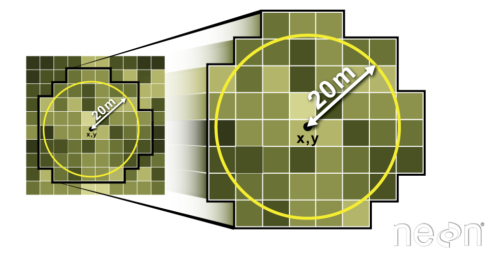

```{r setup, echo=FALSE, message=FALSE}
source("../bin/chunk-options.R")
# source("../setup.R")
knitr_fig_path("05-")
```

```{r load-libraries, echo = FALSE, results = 'hide', message = FALSE, warning = FALSE}
library(sf)
library(raster)
library(rgdal)
library(ggplot2)
library(dplyr)
```


```{r load-data, echo = FALSE, results='hide'}
# Learners will have this data loaded from earlier episodes
# shapefiles
# setwd("_episodes_rmd")
erie_zones   <- st_read("data/erie_zones.shp")
erie_outline <- st_read("data/erie_outline.shp")

# raster
erie_bathy    <- raster("data/erie_bathy.tif")
erie_bathy_df <- as.data.frame(erie_bathy, xy = TRUE)

# fish locations
fish_tracks    <- read.csv("data/fish_tracks.csv")
utm17nCRS      <- st_crs(erie_outline)
fish_locations <- st_as_sf(fish_tracks, coords = c("X", "Y"), 
                                   crs = utm17nCRS)
```

> ## Things You’ll Need To Complete This Episode
>
> See the [lesson homepage]({{ site.baseurl }}) for detailed information about the software,
> data, and other prerequisites you will need to work through the examples in this episode.
{: .prereq}

This episode explains how to crop a raster using the extent of a vector
shapefile. We will also cover how to extract values from a raster that occur
within a set of polygons, or in a buffer (surrounding) region around a set of
points.

## Crop a Raster to Vector Extent

We often work with spatial layers that have different spatial extents. The
spatial extent of a shapefile or R spatial object represents the geographic
"edge" or location that is the furthest north, south east and west. Thus is
represents the overall geographic coverage of the spatial object.

 Image Source: National
Ecological Observatory Network (NEON)

The graphic below illustrates the extent of several of the spatial layers that
we have worked with in this workshop:

* Lake erie outline (AOI) -- blue
* Fish tracking locations (marked with white dots)-- black
* An elevation surface in GeoTIFF format -- green
* Walleye management zones -- rainbow

```{r view-extents, echo = FALSE}
# code not shown, for demonstration purposes only
# convert erie_bathy_df to a spatial object
erie_bathy_sp <- st_as_sf(erie_bathy_df, coords = c("x", "y"), crs = utm17nCRS)
# approximate the boundary box with a random sample of raster points
erie_bathy_rand_sample <- sample_n(erie_bathy_sp, 10000)
```

```{r compare-data-extents, echo = FALSE}
# code not shown, for demonstration purposes only 
ggplot() +
  geom_sf(data = st_convex_hull(st_union(erie_bathy_rand_sample)), fill = "green") +
  geom_sf(data = erie_outline, fill = "blue") +
  geom_sf(data = erie_zones, aes(color = MGMTUNIT), size = 1) +
  geom_sf(data = st_convex_hull(st_union(fish_locations)),
          fill = "black", alpha = 0.4) +
  theme(legend.position = "none") + 
  coord_sf()
```

Frequent use cases of cropping a raster file include reducing file size and
creating maps. Sometimes we have a raster file that is much larger than our
study area or area of interest. It is often more efficient to crop the
raster to the extent of our study area to reduce file sizes as we process
our data. Cropping a raster can also be useful when creating pretty maps so
that the raster layer matches the extent of the desired vector layers.

## Crop a Raster Using Vector Extent

We can use the `crop()` function to crop a raster to the extent of another
spatial object. To do this, we need to specify the raster to be cropped and the
spatial object that will be used to crop the raster. R will use the `extent` of
the spatial object as the cropping boundary.

To illustrate this, we will crop the elevation surface to only include the area of interest (AOI). Let's start by plotting the full extent of the elevation data and overlay where the AOI falls within it. The boundaries of the AOI will be colored blue, and we use `fill = NA` to make the area transparent.

```{r crop-by-vector-extent}
ggplot() +
  geom_raster(data = erie_bathy_df, aes(x = x, y = y, fill = erie_bathy)) + 
  scale_fill_gradientn(name = "Bathymetry", colors = terrain.colors(10)) +
  geom_sf(data = erie_outline, color = "blue", fill = NA) +
  coord_sf()
```

Now that we have visualized the area of the elevation data we want to subset, we can
perform the cropping operation. We are going to create a new object with only
the portion of the elevation data that falls within the boundaries of the AOI. The function `crop()` is from the raster package and doesn't know how to deal with `sf` objects. Therefore, we first need to convert `erie_outline` from a `sf` object to "Spatial" object.

```{r}
erie_bathy_Cropped <- crop(x = erie_bathy, y = as_Spatial(erie_outline))
```

Now we can plot the cropped Lake Erie data, along with a boundary box showing 
the full elevation data extent. However, remember, since this is raster data, we
need to convert to a data frame in order to plot using `ggplot`. To get the 
boundary box from Lake Erie, the `st_bbox()` will extract the 4 corners of the
rectangle that encompass all the features contained in this object. The
`st_as_sfc()` function converts these 4 coordinates into a polygon that we can plot:

```{r show-cropped-area}
erie_bathy_Cropped_df <- as.data.frame(erie_bathy_Cropped, xy = TRUE)

ggplot() +
  geom_sf(data = st_as_sfc(st_bbox(erie_bathy)), fill = "green",
          color = "green", alpha = .2) +  
  geom_raster(data = erie_bathy_Cropped_df,
              aes(x = x, y = y, fill = erie_bathy)) + 
  scale_fill_gradientn(name = "Bathymetry", colors = terrain.colors(10)) + 
  coord_sf()
```

The plot above shows that the full Lake Erie extent (plotted in green) is much larger
than the resulting cropped raster. Our new cropped Lake Erie now has the same extent
as the `erie_outline` object that was used as a crop extent (blue border
below).

```{r view-crop-extent}
ggplot() +
  geom_raster(data = erie_bathy_Cropped_df,
              aes(x = x, y = y, fill = erie_bathy)) + 
  geom_sf(data = erie_outline, color = "blue", fill = NA) + 
  scale_fill_gradientn(name = "Bathymetry", colors = terrain.colors(10)) + 
  coord_sf()
```

We can look at the extent of all of our other objects we have to work with here.

``` {r view-extent}
st_bbox(erie_bathy)
st_bbox(erie_bathy_Cropped)
st_bbox(erie_outline)
st_bbox(fish_locations)
```

It would be nice to see our fishing tracking locations plotted on top of the
Bathymetry information.

> ## Challenge: Crop to Vector Points Extent
> 
> 1. Crop the Bathymetry surface to the extent of the fish tracking locations.
> 2. Plot the fish tracking location points on top of the Bathymetry surface.
> 
> > ## Answers
> > 
> > ```{r challenge-code-crop-raster-points}
> > 
> > erie_bathy_crop <- crop(x = erie_bathy, y = as(fish_locations, "Spatial"))
> > 
> > erie_bathy_crop_df <- as.data.frame(erie_bathy_crop, xy = TRUE)
> > 
> > ggplot() + 
> >   geom_raster(data = erie_bathy_crop_df, aes(x = x, y = y, fill = erie_bathy)) + 
> >   scale_fill_gradientn(name = "Bathymetry", colors = terrain.colors(10)) + 
> >   geom_sf(data = fish_locations) + 
> >   coord_sf()
> > ```
> {: .solution}
{: .challenge}

## Define an Extent

So far, we have used a shapefile to crop the extent of a raster dataset.
Alternatively, we can also the `extent()` function to define an extent to be
used as a cropping boundary. This creates a new object of class extent. Here we
will provide the `extent()` function our xmin, xmax, ymin, and ymax (in that
order).

```{r}
new_extent <- extent(285729, 385729, 4580282, 4752964)
class(new_extent)
```

> ## Data Tip
>
> The extent can be created from a numeric vector (as shown above), a matrix, or
> a list. For more details see the `extent()` function help file
> (`?raster::extent`).
{: .callout}

Once we have defined our new extent, we can use the `crop()` function to crop
our raster to this extent object.

```{r crop-using-drawn-extent}
erie_bathy_manual_cropped <- crop(x = erie_bathy, y = new_extent)
```

To plot this data using `ggplot()` we need to convert it to a dataframe. 

```{r}
erie_bathy_manual_cropped_df <- as.data.frame(erie_bathy_manual_cropped, 
                                                xy = TRUE)
```

Now we can plot this cropped data. We will show the AOI boundary on the same plot for scale.

```{r show-manual-crop-area}
ggplot() + 
  geom_raster(data = erie_bathy_manual_cropped_df,
              aes(x = x, y = y, fill = erie_bathy)) + 
  scale_fill_gradientn(name = "Bathymetry", colors = terrain.colors(10)) + 
  geom_sf(data = erie_outline, color = "blue", fill = NA) +
  coord_sf()
```

## Extract Raster Pixels Values Using Vector Polygons

Often we want to extract values from a raster layer for particular locations -
for example, our fish tracking locations that we are sampling. We can extract all pixel values within 20m of our x,y point of interest. These can then be summarized into some value of interest (e.g. mean, maximum, total).


To do this in R, we use the `extract()` function. The `extract()` function
requires:

* The raster that we wish to extract values from,
* The vector layer containing the polygons that we wish to use as a boundary or
boundaries,
* we can tell it to store the output values in a data frame using
`df = TRUE`. (This is optional, the default is to return a list, NOT a data frame.) .

We will begin by extracting all bathymetry pixel values for our fish tracking locations.

```{r extract-from-raster}
fish_tracks_bathy <- extract(x = erie_bathy,
                       y = as(fish_locations, "Spatial"),
                       df = TRUE)

str(fish_tracks_bathy)
```

When we use the `extract()` function, R extracts the value for each pixel located
within the boundary of the polygon being used to perform the extraction - in
this case the `fish_locations` object (a point layer). Here, the
function extracted values from 1,366 pixels.

We can create a histogram of depth values within the boundary to better
understand the structure or depth distribution at our fish tracking locations. We 
will use the column `erie_bathy` from our data frame as our x values, as this column
represents the depths for each pixel.

```{r view-extract-histogram}
ggplot() + 
  geom_histogram(data = fish_tracks_bathy, aes(x = erie_bathy)) +
  ggtitle("Histogram of Bathymetry Values (m)") +
  xlab("Depth") + 
  ylab("Frequency of Pixels")
```

 We can also use the
`summary()` function to view descriptive statistics including min, max, and mean
height values. These values help us better the depth at our fishing tracking locations.

```{r}
summary(fish_tracks_bathy$erie_bathy)
```

## Summarize Extracted Raster Values

We often want to extract summary values from a raster. We can tell R the type
of summary statistic we are interested in using the `fun =` argument. Let's extract
a mean height value for our AOI. Because we are extracting only a single number, 
we will not use the `df = TRUE` argument. 

```{r summarize-extract }
mean_erie_bathy_AOI <- raster::extract(x = erie_bathy,
                              y = as(erie_outline, "Spatial"),
                              fun = mean)

mean_erie_bathy_AOI
```

It appears that the mean depth value, extracted from our bathymetry model is `r mean_erie_bathy_AOI` meters.

## Extract Data using x,y Locations

We can also extract pixel values from a raster by defining a buffer or area
surrounding individual point locations using the `extract()` function. To do this
we define the summary argument (`fun = mean`) and the buffer distance 
(`buffer = 20`) which represents the radius of a circular region around each point.
By default, the units of the buffer are the same units as the data's CRS. All pixels
that are touched by the buffer region are included in the extract.



Source: National Ecological Observatory Network (NEON).

Let's put this into practice by figuring out the mean depth in the
20m around the fish tracking locations (`fish_locations`). Because we are extracting
only a single number, we will not use the `df = TRUE` argument. 

```{r extract-point-to-buffer }
mean_erie_fish <- extract(x = erie_bathy,
                           y = as(fish_locations, "Spatial"),
                           fun = mean, buffer = 20)

mean_erie_fish
```

> ## Challenge: Extract buffered bathymetry values for fish tracking location
> 
> 1) Use the fish tracking object (`fish_locations`) to extract an average depth for the
> area within 20m of each point location. Because there are 
> multiple fish tracking locations, there will be multiple averages returned, so the `df = TRUE` 
> argument should be used.
> 
> 2) Create a plot showing the mean depth of each area. 
> 
> > ## Answers
> > 
> > ```{r hist-tree-height-veg-plot}
> > # extract data at each fish tracking location
> > # mean_erie_fish_all <- extract(x = erie_bathy,
> > #                                y = as(fish_locations, "Spatial"),
> > #                               buffer = 20,
> > #                               fun = mean,
> > #                               df = TRUE)
> > 
> > # view data
> > # mean_erie_fish_all
> > 
> > # plot data
> > # ggplot(data = mean_erie_fish_all, aes(ID, erie_bathy)) + 
> > #  geom_col() + 
> > #  ggtitle("Mean Depth around each location") + 
> > #  xlab("ID") + 
> > #  ylab("Depth (m)")
> > ```
> {: .solution}
{: .challenge}


